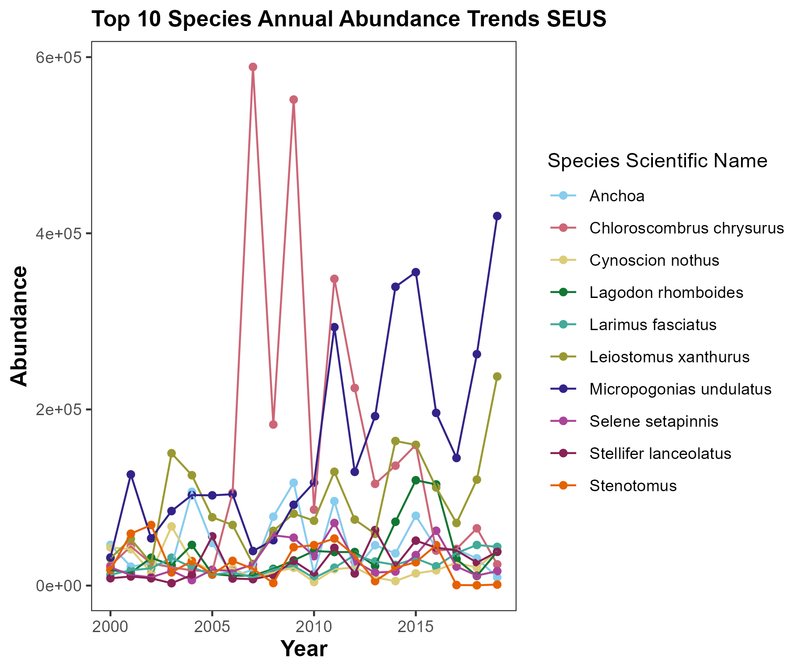
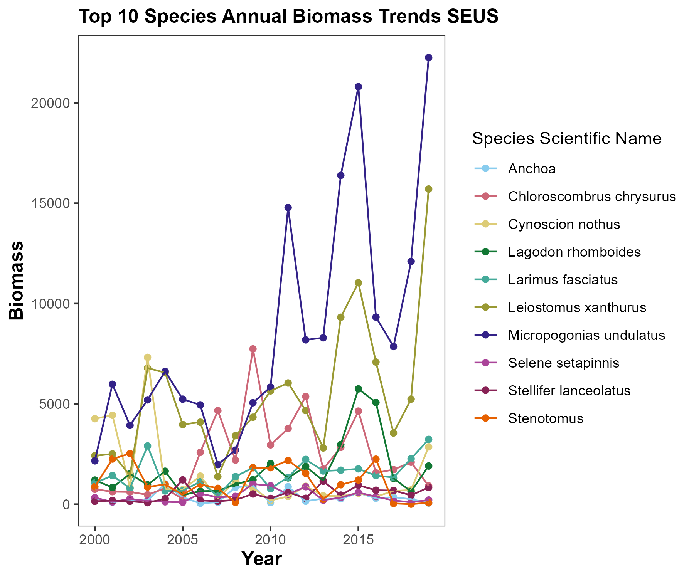

## Introduction

The purpose of this repository is to understand community changes in
FishGlob_data from the South East United States (SEUS). A link to their
github repository is here: <https://github.com/AquaAuma/FishGlob_data>

A citation for their work is here: Maureaud, A. A., Palacios-Abrantes,
J., kitchel, Z., Mannocci, L., Pinsky, M., Fredston, A., ... Merigot, B.
(2023, January 11). FISHGLOB_data: an integrated database of fish
biodiversity sampled with scientific bottom-trawl surveys.
<https://doi.org/10.31219/osf.io/2bcjw>

I am interested in how to predict high abundances and biomass SEUS fish
and want to build a tree based model of what environmental factors drive
distributions of fishes in different families and species.

## Exploratory Data Analysis

Variables we could include: - Location (Lat/Long) - Date - Family -
Weight - Depth - Temperature (surface/bottom)

Our data's sampling effort has changed over time, so we did some
exploratory diagnostics in the "EDA.Rmd" file in the "scripts" folder.
Our final set of data points spans from 2000-2019 and covers most
coastal areas of the South Atlantic Bight (Figs 1 & 2).

Figure 1. Site map pre-data cleaning. Sampling effort has clearly
changed over time.

Figure 2. Site map post-data cleaning. Sampling effort is now
standardized over time.

Here are the top 10 species in the dataset by abundance and biomass.

Figure 3. Annual abundance trends over time. *Chloroscombrus chrysurus*
(Atlantic bumper), *Micropogonias undulatus* (Atlantic Croaker), and
*Leiostomus xanthurus* (Spot) seem to be quite abundant over time.

Figure 4. Annual biomass trends over time. *Chloroscombrus chrysurus*
(Atlantic bumper), *Micropogonias undulatus* (Atlantic Croaker), and
*Leiostomus xanthurus* (Spot) seem to have high biomass over time.

## Tree Based Models

I ran models with the response variable Catch Per Unit Effort (CPUE) for
each species and family and the following explanatory variables:
Latitude, Longitude, Year of catch, Month of catch, Sea Surface
Temperature (SST, degrees C), Sea Bottom Temperature (SBT, degrees C),
and depth (meters). We then ran tree based models using xgboost to find
out which variable was most important in determining CPUE. On the
species level, the highest ranking variables were bottom temperature,
latitude, and year, respectively (Figure 5). On the family level, the
highest ranking variables were latitude, bottom temperature, and year,
respectively (Figure 6). This simple analysis demonstrates how important
space, time, and temperature are to each species. I was surprised to
find depth was not a major player, however it seems these sites are at
likely very similar depths (Figure 7).

Figure 5. Count of each species model that ranked the variables on the x
axis as most important.

 Figure 6. Count of each
species model that ranked the variables on the x axis as most important.

Figure 7. Post analysis bathymetry map.
